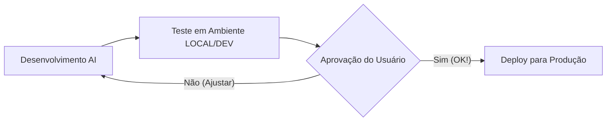

# Planejamento: Domínio Personalizado e Fluxo de Trabalho

Este documento descreve como profissionalizar o acesso ao Dashboard e organizar o processo de atualizações.

## 1. Domínio Personalizado (.com)
Sim, você pode usar qualquer domínio que possua (ex: `dash.emidias.com` ou `emidiasprogramatica.com.br`).

### Como configurar na Cloudflare:
1.  **Compre o domínio:** Você pode comprar no Registro.br, GoDaddy ou na própria Cloudflare.
2.  **Vincule ao Projeto:** 
    *   No painel da Cloudflare, acesse seu Worker `displayce-dashboard`.
    *   Vá na aba **Settings (Configurações)** -> **Triggers (Gatilhos)**.
    *   Procure por **Custom Domains** e clique em **Add Custom Domain**.
    *   Digite o domínio que você quer usar.
3.  **Certificado SSL:** A Cloudflare gerará o cadeado de segurança (HTTPS) automaticamente e de graça para o seu novo domínio.

---

## 2. Novo Fluxo de Trabalho (Ambiente Dev)
A partir de agora, seguiremos o fluxo sugerido para garantir a estabilidade do site oficial:

### Como funcionará:
1.  **Fase de Implementação:** Eu farei as mudanças nos arquivos.
2.  **Link de Teste (Preview):** Eu publicarei as mudanças em um link de teste exclusivo (ex: `displayce-dev.tatico1.workers.dev`). 
3.  **Validação:** **Você acessa esse link no seu próprio navegador** (computador ou celular) e testa tudo.
4.  **Seu OK:** Você me diz: "Pode passar para o site oficial".
5.  **Publicação:** Só então eu atualizo o seu link principal.

---

## 3. Benefícios
- **Visualização Real:** Você testa no seu navegador, não apenas por prints.
- **Segurança:** O site principal nunca quebra por erro de código em desenvolvimento.
- **Marca:** Um domínio `.com` passa muito mais credibilidade.
- **Controle:** Você tem a palavra final.
